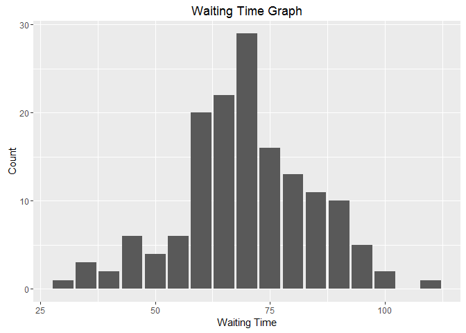
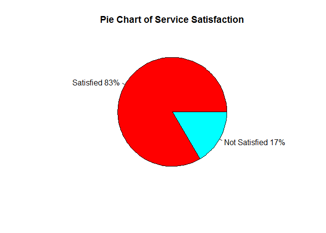
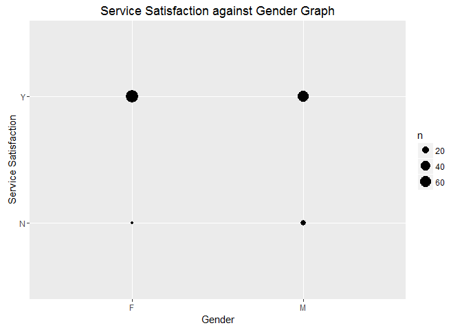
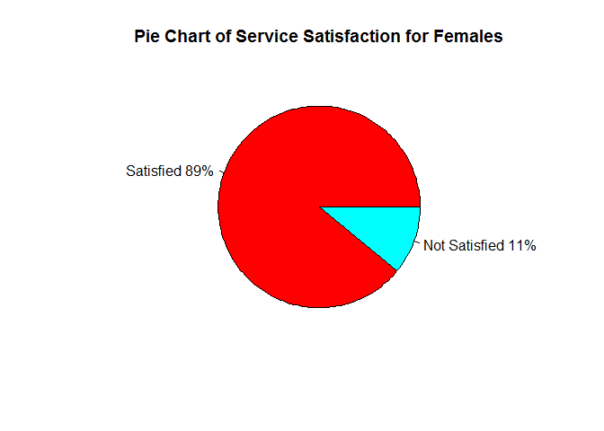
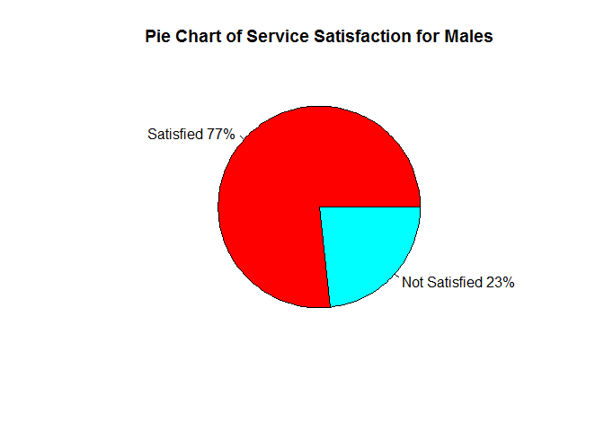
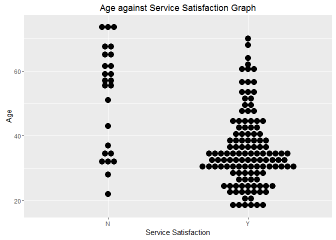
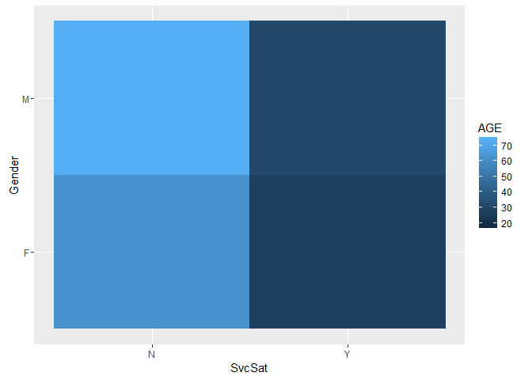
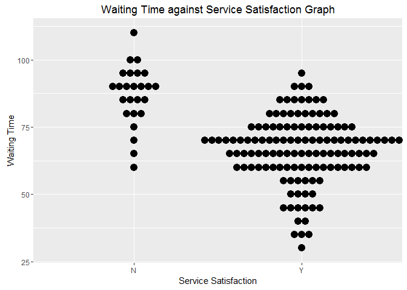
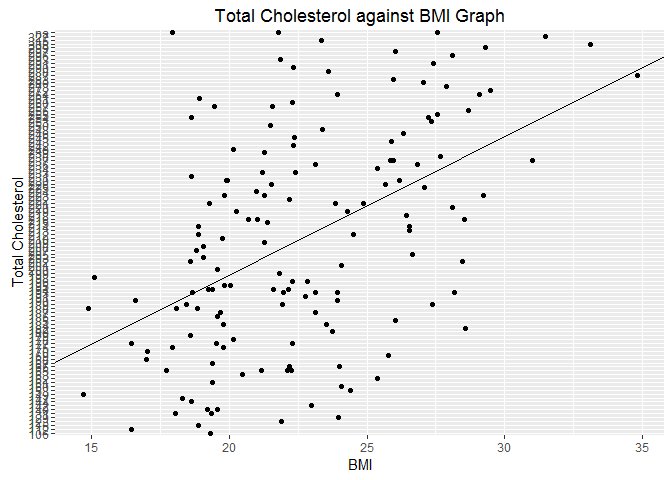

Q1ai.

  

    ##   Average_Waiting_Time
    ## 1             69.76821

The KPI for waiting time could be averaged to 69.76821mins/patient.

Q1aii.

  

    ##   SvcSat freq
    ## 1      N   25
    ## 2      Y  126

The KPI for Service Standard could be averaged to 126/126+25 = 83%.

Q1b.

  
 Female:

    ##   SvcSat freq
    ## 1      N    9
    ## 2      Y   73

  

Male:

    ##   SvcSat freq
    ## 1      N   16
    ## 2      Y   53

  
 From the pie charts we can see that: Females have a higher percentage
(89%) of being satisfied with the service as compared to males (73%).

  
 From the graph above, we can see that the younger adults are more
likely to input their Service Satisfaction as 'Y' (Satisfied), while the
elderly are more likely to input their Service Satisfaction as 'N' (Not
satisfied).

  
 From the graph above, where all 3 variables are included, we can see
that the older adults are more likely to be unsatisfied with the service
while the younger aduts are more likely to be satisfied with the
service.

In addition, using the 1st graph above, we can tell that males are more
likely to be unsatisfied as compared to the females.

Qc.

  
 As according to the graph above, we can conclude that there is a
correlation between waiting time and service satisfaction. For waiting
times that are longer than 75mins, patients are more likely to be
unsatisfied (N). On the other hand, shorter waiting times clearly show
satisfied results (Y).

Qd.

  

    ## (Intercept)         BMI 
    ##  -29.391577    3.552667

As seen from the results obtained above, it shows that there is a
positive correlation between BMI and Total Cholesterol. When BMI
increases, Total Cholesterol will also increase.

Qe.

    ##        1 
    ## 24.50793

Assumptions:

1.  All Chinese Males are the same. Thus, is it possible to predict the
    BMI based on other Chinese Males data

Hence, using the predict() function, his BMI would be 24.50793.
