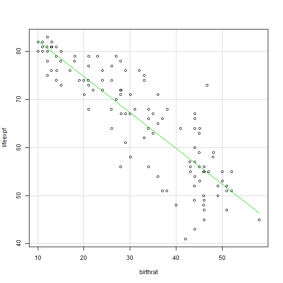

<!-- R Commander Markdown Template -->

Tutorial 5
=======================

### Soh Su Xian Alicia A0114334U

### 2016-02-19


```

Call:
lm(formula = lifeexpf ~ birthrat, data = country)

Residuals:
     Min       1Q   Median       3Q      Max 
-17.3110  -2.6524  -0.0768   3.1784  18.1892 

Coefficients:
            Estimate Std. Error t value Pr(>|t|)    
(Intercept) 89.58892    1.31645   68.05   <2e-16 ***
birthrat    -0.74471    0.03878  -19.20   <2e-16 ***
---
Signif. codes:  0 '***' 0.001 '**' 0.01 '*' 0.05 '.' 0.1 ' ' 1

Residual standard error: 5.619 on 119 degrees of freedom
  (1 observation deleted due to missingness)
Multiple R-squared:  0.756,	Adjusted R-squared:  0.754 
F-statistic: 368.8 on 1 and 119 DF,  p-value: < 2.2e-16
```


Answer: Since the p-value: < 2.2e-16 (less than 0.05), this tells us that there is a linear relationship between the two variables.
From the data obtained, the correlation coefficient is 0.869 (3sf). This can be calculated by square rooting the Multiple R-squared:  0.756.
Since the value is close to 1, the linear relationship is relatively strong. 
The linear relationship is downwards (as seen from the graph below). The higher the birth rate, the lower the life expectancy.




